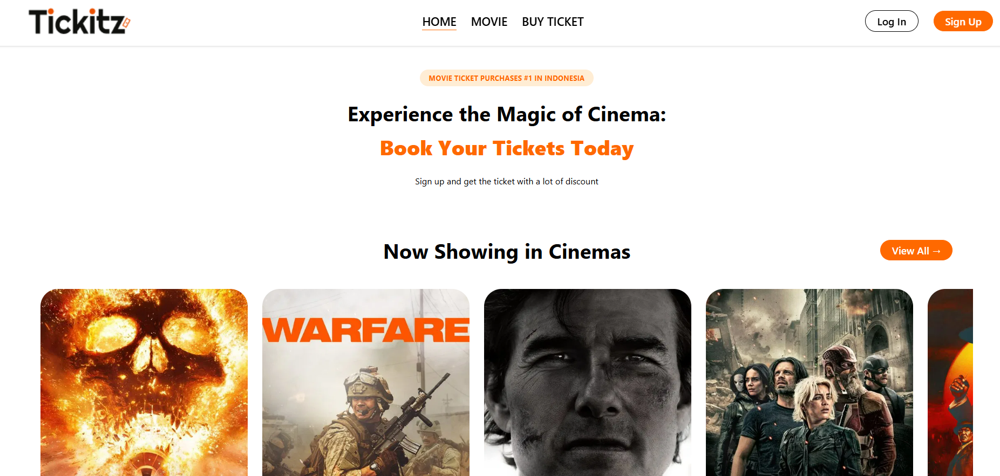

# Basic React Project Tickitz

This project is for training only. This is a react based cinema ticketing web application. This project is using The Movie Database (TMDB) API to display list of movie.
 
## Preview



## Prerequisites
1. Node.js : Make sure you have Node.js installed on your machine. You can download it from nodejs.org
2. TMDB API Key: This project requires a TMDB API key to fetch movie data. Follow the steps below to obtain one.

### Setting Up the TMDB API Key
1. Get a TMDB API Key
- Visit The Movie Database (TMDB) and create an account or log in
- Go to your account settings and navigate to the "API" section
- Request a new API key and copy the provided key
2. Create .env File:
- In the root directory of the project, create a file named .env
- Add the following line to the .env file, replacing your_tmdb_api_key_here with your actual TMDB API key:
```
VITE_TMDB_API_KEY=your_tmdb_api_key_here
```
3. Save the file. Note: The .env file is ignored by .gitignore to keep sensitive information secure, so it will not be included in the repository

## How to Run this Project (Manual/Docker)

### Manually 
1. Clone this project
```
git clone https://github.com/mdavindarinaldy/fgo24-Tickitz.git
```
2. Set up the .env file
- Follow the instructions in the "Setting Up the TMDB API Key" section above to create the .env file with your TMDB API key
2. Install dependencies
```
npm install
``` 
3. Run the project
```
npm run dev
```
4. Project will be running on http://localhost:5173

### With Docker
1. Clone this project
```
git clone https://github.com/mdavindarinaldy/fgo24-Tickitz.git
```
2. Set up the .env file
- Follow the instructions in the "Setting Up the TMDB API Key" section above to create the .env file with your TMDB API key
3. Build image
```
docker build . -t ubuntu:tickitz
```
4. Run image with docker
```
docker run -p 8080:80 -d ubuntu:tickitz
```
5. Project will be running on http://localhost:8080


## Dependencies
This project using node.js to run, make sure to install node on your machine. Other than that, this project also includes:
- Vite: For fast development and build processes
- React: For building the user interface
- React Hook: For managing state and side effects
- React Router DOM: For client-side routing
- React Hook Form: For form handling
- ESLint: For code linting and maintaining code quality

## Basic Information
This project is part of training in Kodacademy Bootcamp Batch 24 made by Muhammad Davinda Rinaldy
